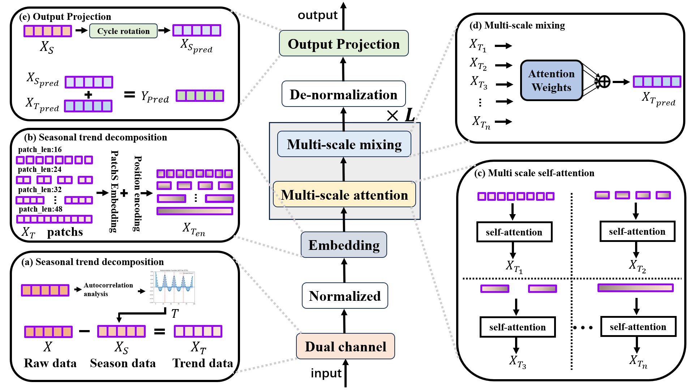

> A Novel Dual-Channel Model with Adaptive Multi-Scale Attention for Time Series Forecasting


DASformer is an innovative time series forecasting model that combines a **dual-channel multivariate feature extractor** and an **adaptive multi-scale attention mechanism**, suitable for both multivariate and univariate time series forecasting tasks, including both short-term and long-term predictions. The model achieves state-of-the-art performance on nine real-world benchmark datasets, making it especially applicable in fields such as energy, transportation, finance, and meteorology.



✨ Key Features

- 🚦 **Dual-Channel Feature Extractor**: Models seasonal fluctuations and long-term trends separately, dynamically decoupling multi-scale patterns.
- 🔍 **Adaptive Multi-Scale Attention Mechanis**m: Multi-granularity blocks + dynamic weight fusion, enhancing the ability to model long-term dependencies.
- 🔁 **Periodic Forecasting Module**: Uses automatic cycle detection and cyclic sampling strategies to improve periodic pattern modeling.
- 📉 **Temperature Decay Learning Rate Scheduling**: Introduces a temperature-controlled linear decay strategy to enhance convergence stability.
- 🏆 Surpasses SOTA models across datasets such as ETTh, ETTm, Electricity, Traffic, Exchange, and Solar-Energy.

## 📦 Installation and Environment Dependencies

```bash
git clone https://github.com/yourusername/DASformer.git
cd DASformer
pip install -r requirements.txt
````


### Recommended Environment

* Python >= 3.8
* PyTorch >= 1.10
* CUDA (optional, for GPU acceleration)

## 📁 Project Structure

```
DASformer/
├── data/               # Dataset loading and preprocessing
├── models/             # DASformer model definitions
├── layers/             # Model components
├── experiments/        # Various training and testing scripts
├── utils/              # Utility functions
├── run_longExp.py             # Main training entry point
└── README.md           # Project documentation
```

## 📊 Quick Start

### Training the Model

```bash
python main.py --model DASformer --dataset ETTm1 --pred_len 96
```

You can control the prediction range with the following parameters:

* `--seq_len`: Input length (default 96)
* `--pred_len`: Prediction length (e.g., 96, 192, 336, 720)
* `--batch_size`: Batch size (e.g., 32)
* `--learning_rate`: Initial learning rate (default 1e-3)

## 📈 Evaluation Metrics

The model evaluation metrics include:

* MAE (Mean Absolute Error)
* MSE (Mean Squared Error)

The evaluation script will automatically output these two metrics after training.

## 📝 Open Source License

This project is open-sourced under the MIT License. Feel free to use and modify it.

---

## 💡 Contact the Authors

For questions or collaboration inquiries, please contact:

* 📧 [2024120869@m.ldu.edu.cn](mailto:2024120869@m.ldu.edu.cn) (Shuqing Wang)
* 📧 [iamzxf@ldu.edu.cn](mailto:iamzxf@ldu.edu.cn) (Xiaofeng Zhang)

---

🎉 Thank you for your interest in the DASformer project. Feel free to submit Issues or PRs to improve this project!

```
```
